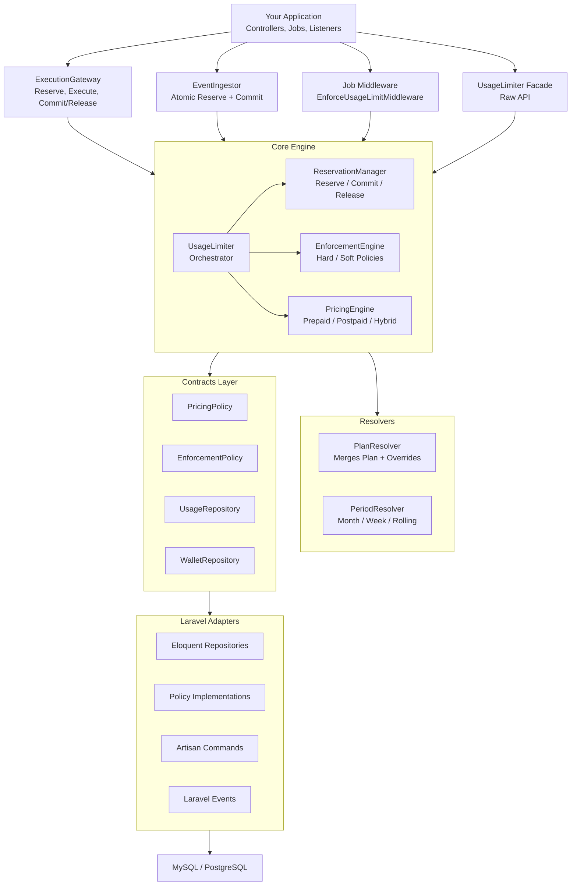

# Laravel Usage Limiter

[](https://packagist.org/packages/moneo/laravel-usage-limiter)
[](https://github.com/moneo/laravel-usage-limiter/actions/workflows/tests.yml)
[](https://codecov.io/gh/moneo/laravel-usage-limiter)
[](https://phpstan.org/)
[](https://packagist.org/packages/moneo/laravel-usage-limiter)
[](https://laravel.com)
[](LICENSE)

**A production grade, metric agnostic usage metering and enforcement engine for Laravel.**

Track any resource. Enforce any limit. Bill any way you want. Built for SaaS teams that need atomic concurrency safety, idempotency guarantees, and pluggable pricing models out of the box.

## Table of Contents

- [Built For](#built-for)
- [Features](#features)
- [Requirements](#requirements)
- [Installation](#installation)
- [Core Concepts](#core-concepts)
- [Architecture](#architecture)
- [Quick Start](#quick-start)
- [Per-User Usage](#per-user-usage-without-teams-or-workspaces)
- [Integration Patterns](#integration-patterns)
- [Raw API](#raw-api)
- [Database Schema](#database-schema)
- [Plans and Overrides](#plans-and-overrides)
- [Pricing Modes](#pricing-modes)
- [Enforcement Modes](#enforcement-modes)
- [Idempotency](#idempotency)
- [Events](#events)
- [Artisan Commands](#artisan-commands)
- [Configuration Reference](#configuration-reference)
- [Extending the Package](#extending-the-package)
- [Testing](#testing)
- [License](#license)

## Built For

This package is designed for any Laravel application that meters, limits, or bills for resource consumption. If you recognize your product below, this is for you.

**AI Platforms** that sell token based access. Track `ai_tokens` per request, enforce monthly quotas, and charge overages per 1K tokens. *Example: an AI writing assistant that gives Pro users 500K tokens per month, then charges $0.02 for each additional 1K tokens.*

**API Providers** that meter endpoint calls. Track `api_calls` with hard enforcement per billing period. *Example: a geocoding API that includes 10,000 requests per month on the Starter plan and blocks further calls when exhausted.*

**Video and Media Processing Platforms** that bill by compute time. Track `execution_minutes`, reserve capacity before encoding begins, and release on failure. *Example: a video transcoding service where each job reserves estimated minutes before processing starts, and only commits the actual usage on success.*

**IoT and Event Ingestion Platforms** that count inbound data. Track `events` at massive throughput with postpaid overage billing. *Example: a sensor data platform ingesting 50,000 events per second per account with invoiced overages at the end of each month.*

**Storage Providers** that meter disk usage. Track `storage_mb` with soft enforcement and configurable warnings. *Example: a file hosting service that warns users at 80% of their 100GB limit and blocks uploads at 110%.*

**Multi Tenant SaaS** with per workspace quotas. Track `seats`, `projects`, `builds`, or any custom metric you define. Usage is shared across all team members and workspaces under the same billing account.

## Features

* **Metric agnostic.** Define any metric as a string. The engine never hardcodes metric names.
* **Account level aggregation.** All usage is tracked per `billing_account_id`, shared across teams and workspaces.
* **Atomic enforcement.** A single SQL statement performs "check + reserve" to prevent concurrency overshoot. No TOCTOU race conditions.
* **Reserve, Execute, Commit/Release lifecycle.** Capacity is reserved before work begins, committed on success, released on failure.
* **Hard and soft enforcement.** Hard mode blocks at the limit. Soft mode allows with a warning and records overages.
* **Prepaid, postpaid, and hybrid pricing.** Wallet based debit, overage accumulation for invoicing, or included allowance with overflow. All policy driven.
* **Idempotency at every layer.** Prevents double counting on retries and double charging on wallet operations.
* **Pluggable architecture.** Swap pricing policies, enforcement policies, period resolvers, and plan resolvers through configuration or the service container.
* **Leakage prevention.** Three centralized integration points (Job Middleware, ExecutionGateway, EventIngestor) plus reconciliation commands to detect drift.
* **Production ready.** 10 database tables with proper indexes, BIGINT counters, and atomic SQL patterns designed for high concurrency.

## Requirements

* PHP 8.2 or higher
* Laravel 11 or Laravel 12

## Installation

Install the package via Composer:

```bash
composer require moneo/laravel-usage-limiter
```

Publish the configuration file:

```bash
php artisan vendor:publish --tag=usage-limiter-config
```

Run the migrations to create the required database tables:

```bash
php artisan migrate
```

## Core Concepts

**Billing Account.** The primary dimension for all usage tracking. Every reservation, aggregate, and transaction belongs to a `billing_account_id`. A billing account typically maps to an organization, team, or customer in your application.

**Metric.** A dynamic string identifier such as `ai_tokens`, `api_calls`, `execution_minutes`, or `storage_mb`. The engine places no restrictions on what you name your metrics.

**Period.** The time window for usage aggregation. Defaults to calendar month (UTC). The package ships with calendar month, weekly, and rolling 30 day resolvers. You can write your own.

**Plan.** A named collection of metric limits. Each plan defines, per metric: the included amount, whether overage is allowed, overage pricing, pricing mode, and enforcement mode. Plans are first class database entities.

**Enforcement Mode.** Determines what happens when usage reaches the limit. `hard` denies the reservation. `soft` allows it but fires warning events and records the overage.

**Pricing Mode.** Determines how overage is billed. `prepaid` debits a wallet balance immediately. `postpaid` accumulates overage records for later invoicing. `hybrid` provides a free included allowance with overflow handled by either prepaid or postpaid.

## Architecture



## Quick Start

This example walks through a complete AI platform scenario: teams get 100,000 tokens per month on the free plan and 1,000,000 tokens per month on the pro plan, with $0.01 per 1,000 token overage on the pro plan.

### Step 1: Create Plans

```php
use Moneo\UsageLimiter\Models\Plan;
use Moneo\UsageLimiter\Models\PlanMetricLimit;

// Free plan: 100K tokens, hard limit, no overage
$free = Plan::create(['code' => 'free', 'name' => 'Free']);

PlanMetricLimit::create([
    'plan_id'          => $free->id,
    'metric_code'      => 'ai_tokens',
    'included_amount'  => 100_000,
    'overage_enabled'  => false,
    'enforcement_mode' => 'hard',
    'pricing_mode'     => 'postpaid',
]);

// Pro plan: 1M tokens, overage at $0.01 per 1K tokens
$pro = Plan::create(['code' => 'pro', 'name' => 'Pro']);

PlanMetricLimit::create([
    'plan_id'             => $pro->id,
    'metric_code'         => 'ai_tokens',
    'included_amount'     => 1_000_000,
    'overage_enabled'     => true,
    'overage_unit_size'   => 1_000,
    'overage_price_cents' => 1,       // $0.01 per 1K tokens
    'enforcement_mode'    => 'hard',
    'pricing_mode'        => 'postpaid',
    'max_overage_amount'  => 5_000_000, // Cap at 5M overage tokens
]);
```

### Step 2: Create a Billing Account and Assign a Plan

```php
use Moneo\UsageLimiter\Models\BillingAccount;
use Moneo\UsageLimiter\Models\BillingAccountPlanAssignment;

$account = BillingAccount::create([
    'external_id' => 'team_' . $team->id,
    'name'        => $team->name,
]);

BillingAccountPlanAssignment::create([
    'billing_account_id' => $account->id,
    'plan_id'            => $pro->id,
    'started_at'         => now(),
]);
```

### Step 3: Meter an AI Completion Call

```php
use Moneo\UsageLimiter\Entrypoints\ExecutionGateway;

$gateway = app(ExecutionGateway::class);

$response = $gateway->execute(
    billingAccountId: $account->id,
    metricCode: 'ai_tokens',
    amount: $estimatedTokens,
    callback: function () use ($prompt) {
        return OpenAI::chat()->create([
            'model'    => 'gpt-4',
            'messages' => [['role' => 'user', 'content' => $prompt]],
        ]);
    },
    idempotencyKey: "chat:{$requestId}",
);

// If the token limit is exceeded, UsageLimitExceededException is thrown
// BEFORE the OpenAI call is made. No wasted money.
//
// If the OpenAI call fails, the reservation is automatically released.
// No phantom usage on the account.
```

### Step 4: Check Remaining Quota in the UI

```php
use Moneo\UsageLimiter\Core\UsageLimiter;

$limiter = app(UsageLimiter::class);
$usage = $limiter->currentUsage($account->id, 'ai_tokens');

// $usage = [
//     'committed' => 42000,
//     'reserved'  => 1500,
//     'limit'     => 1000000,
//     'remaining' => 956500,
// ]
```

## Per-User Usage (Without Teams or Workspaces)

The quick start above uses a team as the billing entity, but the package is completely model agnostic. All usage tracking is keyed by `billing_account_id`, which you can attach to any Eloquent model: a `User`, a `Team`, a `Workspace`, an `Organization`, or anything else.

If your application has individual user accounts without teams, simply create a `BillingAccount` per user.

### Step 1: Create a Billing Account for the User

```php
use Moneo\UsageLimiter\Models\BillingAccount;
use Moneo\UsageLimiter\Models\BillingAccountPlanAssignment;

$account = BillingAccount::create([
    'external_id' => 'user_' . $user->id,
    'name'        => $user->name,
]);

// Store the relation on the user (add a billing_account_id column to your users table)
$user->update(['billing_account_id' => $account->id]);

BillingAccountPlanAssignment::create([
    'billing_account_id' => $account->id,
    'plan_id'            => $pro->id,
    'started_at'         => now(),
]);
```

### Step 2: Add a Relationship to the User Model

```php
// App\Models\User

use Moneo\UsageLimiter\Models\BillingAccount;

public function billingAccount(): BelongsTo
{
    return $this->belongsTo(BillingAccount::class);
}
```

### Step 3: Meter Usage Directly on the User

```php
use Moneo\UsageLimiter\Entrypoints\ExecutionGateway;

$gateway = app(ExecutionGateway::class);

$response = $gateway->execute(
    billingAccountId: $user->billing_account_id,
    metricCode: 'ai_tokens',
    amount: $estimatedTokens,
    callback: fn () => $this->aiService->generate($prompt),
    idempotencyKey: "chat:{$requestId}",
);
```

### Step 4: Check the User's Remaining Quota

```php
use Moneo\UsageLimiter\Core\UsageLimiter;

$limiter = app(UsageLimiter::class);
$usage = $limiter->currentUsage($user->billing_account_id, 'ai_tokens');

// $usage = [
//     'committed' => 42000,
//     'reserved'  => 1500,
//     'limit'     => 1000000,
//     'remaining' => 956500,
// ]
```

This pattern works for any model. Here is how the `billing_account_id` maps depending on your architecture:

| Architecture | Billing Account Belongs To | Resolved Via |
|---|---|---|
| Per-user plans | `User` | `$user->billing_account_id` |
| Team-based | `Team` | `$user->team->billing_account_id` |
| Workspace-based | `Workspace` | `$workspace->billing_account_id` |
| Organization-based | `Organization` | `$organization->billing_account_id` |

## Integration Patterns

The package provides three centralized integration points. Every metered operation in your application should flow through one of these.

### ExecutionGateway

Use `ExecutionGateway` when the metered work has a distinct execution phase: something runs, and you only want to count usage if it succeeds.

```php
use Moneo\UsageLimiter\Entrypoints\ExecutionGateway;

$gateway = app(ExecutionGateway::class);

// Wrap any callable. Reserve happens before, commit on success, release on exception.
$result = $gateway->execute(
    billingAccountId: $team->billing_account_id,
    metricCode: 'ai_tokens',
    amount: 2500,
    callback: fn () => $this->aiService->generateEmbedding($text),
    idempotencyKey: "embed:{$requestId}",
);
```

### EventIngestor

Use `EventIngestor` when there is no execution phase. You simply want to record that something happened: an API call was made, an event was received, bytes were stored.

```php
use Moneo\UsageLimiter\Entrypoints\EventIngestor;

$ingestor = app(EventIngestor::class);

// Single event
$ingestor->ingest(
    billingAccountId: $account->id,
    metricCode: 'api_calls',
    amount: 1,
    idempotencyKey: "api:{$request->header('X-Request-ID')}",
);

// Batch ingestion (multiple metrics in one call)
$ingestor->ingestBatch($account->id, [
    ['metric_code' => 'events', 'amount' => 5, 'idempotency_key' => 'webhook:abc:events'],
    ['metric_code' => 'api_calls', 'amount' => 1, 'idempotency_key' => 'webhook:abc:api'],
]);
```

### Job Middleware

Use `EnforceUsageLimitMiddleware` for Laravel queue jobs. The job must implement the `UsageLimiterAware` interface, which tells the middleware how to extract billing account, metric, amount, and idempotency key.

```php
use Illuminate\Contracts\Queue\ShouldQueue;
use Moneo\UsageLimiter\Contracts\UsageLimiterAware;
use Moneo\UsageLimiter\Middleware\EnforceUsageLimitMiddleware;

class TranscodeVideoJob implements ShouldQueue, UsageLimiterAware
{
    public function __construct(
        public int $teamId,
        public int $videoId,
        public int $estimatedMinutes,
    ) {}

    public function billingAccountId(): int
    {
        return Team::find($this->teamId)->billing_account_id;
    }

    public function metricCode(): string
    {
        return 'execution_minutes';
    }

    public function usageAmount(): int
    {
        return $this->estimatedMinutes;
    }

    public function usageIdempotencyKey(): ?string
    {
        return "transcode:{$this->job->uuid()}";
    }

    public function middleware(): array
    {
        return [new EnforceUsageLimitMiddleware];
    }

    public function handle(): void
    {
        // Your transcoding logic here.
        // If this throws, the usage reservation is released automatically.
    }
}
```

## Raw API

For advanced use cases, you can interact with the `UsageLimiter` directly through its facade or by resolving it from the container.

```php
use Moneo\UsageLimiter\Core\UsageLimiter;
use Moneo\UsageLimiter\DTOs\UsageAttempt;

$limiter = app(UsageLimiter::class);

// Reserve
$reservation = $limiter->reserve(new UsageAttempt(
    billingAccountId: $account->id,
    metricCode: 'ai_tokens',
    amount: 5000,
    idempotencyKey: 'req:abc123',
));

// ... do work ...

// Commit on success
$commitResult = $limiter->commit($reservation->ulid);

// Or release on failure
$releaseResult = $limiter->release($reservation->ulid);
```

**Pre flight check** (read only, no reservation created):

```php
use Moneo\UsageLimiter\DTOs\EnforcementDecision;

$decision = $limiter->check($account->id, 'ai_tokens', 5000);

if ($decision === EnforcementDecision::Deny) {
    return response()->json(['error' => 'Token limit reached'], 429);
}
```

**Current usage query** (for dashboards and billing pages):

```php
$usage = $limiter->currentUsage($account->id, 'ai_tokens');

// Returns: ['committed' => int, 'reserved' => int, 'limit' => int, 'remaining' => int]
```

## Database Schema

The package creates 10 tables, all prefixed with `ul_` by default (configurable via `table_prefix`).

| Table | Purpose |
|---|---|
| `ul_plans` | Named plan definitions (free, starter, pro, enterprise) |
| `ul_plan_metric_limits` | Per metric configuration for each plan: included amount, overage settings, pricing and enforcement mode |
| `ul_billing_accounts` | Billing entities with optional prepaid wallet balance and auto topup settings |
| `ul_billing_account_plan_assignments` | Tracks which plan is assigned to each billing account, with start and end timestamps |
| `ul_billing_account_metric_overrides` | Per account, per metric overrides that take precedence over plan defaults |
| `ul_usage_period_aggregates` | The hot table. One row per (account, metric, period) with atomic `committed_usage` and `reserved_usage` counters |
| `ul_usage_reservations` | Individual reservation records with status (pending, committed, released, expired), ULID, and idempotency key |
| `ul_usage_overages` | Accumulated overage records per (account, metric, period) for postpaid billing |
| `ul_billing_transactions` | Append only wallet transaction ledger for prepaid accounts |
| `ul_idempotency_records` | TTL based idempotency storage for non reservation operations |

## Plans and Overrides

### Defining Plans

Each plan contains one or more metric limits. You can define as many metrics per plan as you need.

```php
$plan = Plan::create(['code' => 'starter', 'name' => 'Starter']);

// API calls: 10K per month, hard enforcement, no overage
PlanMetricLimit::create([
    'plan_id'          => $plan->id,
    'metric_code'      => 'api_calls',
    'included_amount'  => 10_000,
    'enforcement_mode' => 'hard',
    'pricing_mode'     => 'postpaid',
]);

// Storage: 5GB, soft enforcement with overage
PlanMetricLimit::create([
    'plan_id'             => $plan->id,
    'metric_code'         => 'storage_mb',
    'included_amount'     => 5_000,
    'overage_enabled'     => true,
    'overage_unit_size'   => 1_000,     // per 1GB
    'overage_price_cents' => 100,       // $1.00 per GB
    'enforcement_mode'    => 'soft',
    'pricing_mode'        => 'postpaid',
]);
```

### Per Account Overrides

Override any field for a specific account. Non null fields take precedence over the plan default. Null fields fall through to the plan.

```php
use Moneo\UsageLimiter\Models\BillingAccountMetricOverride;

// Give this VIP customer 50K API calls instead of 10K
BillingAccountMetricOverride::create([
    'billing_account_id' => $account->id,
    'metric_code'        => 'api_calls',
    'included_amount'    => 50_000,
    'started_at'         => now(),
    'reason'             => 'VIP customer agreement',
]);

// Remember to invalidate the plan cache
app(UsageLimiter::class)->invalidatePlanCache($account->id);
```

## Pricing Modes

Each metric on a plan can use a different pricing mode. The pricing engine selects the correct policy automatically.

### Prepaid

The billing account has a wallet balance. When usage exceeds the included amount, the wallet is debited immediately on commit. If the wallet cannot afford the charge, the reservation is denied.

```php
PlanMetricLimit::create([
    'plan_id'             => $plan->id,
    'metric_code'         => 'ai_tokens',
    'included_amount'     => 0,
    'overage_enabled'     => true,
    'overage_unit_size'   => 1_000,
    'overage_price_cents' => 2,          // $0.02 per 1K tokens
    'pricing_mode'        => 'prepaid',
    'enforcement_mode'    => 'hard',
]);
```

Auto topup can be configured on the billing account. When the balance drops below the threshold during a reservation, the package fires a `WalletTopupRequested` event. Your application handles the payment processing and credits the wallet.

### Postpaid

Usage is allowed up to the configured limits. Overage is accumulated in the `usage_overages` table and settled at the end of the billing period through your invoicing system.

```php
PlanMetricLimit::create([
    'plan_id'             => $plan->id,
    'metric_code'         => 'api_calls',
    'included_amount'     => 10_000,
    'overage_enabled'     => true,
    'overage_unit_size'   => 1_000,
    'overage_price_cents' => 50,         // $0.50 per 1K calls
    'pricing_mode'        => 'postpaid',
    'enforcement_mode'    => 'hard',
    'max_overage_amount'  => 100_000,    // Cap at 100K overage calls
]);
```

### Hybrid

A free included allowance with overflow handled by either prepaid or postpaid. The `hybrid_overflow_mode` column determines how the billable portion is settled.

```php
PlanMetricLimit::create([
    'plan_id'               => $plan->id,
    'metric_code'           => 'ai_tokens',
    'included_amount'       => 500_000,       // 500K tokens free
    'overage_enabled'       => true,
    'overage_unit_size'     => 1_000,
    'overage_price_cents'   => 1,
    'pricing_mode'          => 'hybrid',
    'hybrid_overflow_mode'  => 'postpaid',    // or 'prepaid'
    'enforcement_mode'      => 'hard',
]);
```

## Enforcement Modes

### Hard Enforcement

Reservations that would push usage above the effective limit are denied. The atomic SQL ensures that two concurrent requests cannot both claim the last available unit. This is the default.

### Soft Enforcement

Reservations always succeed, but the engine flags when usage exceeds the limit by returning `EnforcementDecision::AllowWithWarning`. Overage is recorded for billing. The `LimitExceeded` event fires so your application can notify the user.

## Idempotency

Every critical operation supports idempotency keys to prevent double counting on retries and double charging on wallet debits.

**For queue jobs**, use the job UUID:

```php
public function usageIdempotencyKey(): ?string
{
    return "transcode:{$this->job->uuid()}";
}
```

**For HTTP API calls**, use a client provided header:

```php
$ingestor->ingest(
    billingAccountId: $account->id,
    metricCode: 'api_calls',
    amount: 1,
    idempotencyKey: "api:{$request->header('X-Idempotency-Key')}",
);
```

**For events**, use the event type and identifier:

```php
$ingestor->ingest(
    billingAccountId: $account->id,
    metricCode: 'events',
    amount: 1,
    idempotencyKey: "event:order_placed:{$order->id}",
);
```

Calling `reserve()` or `ingest()` with the same idempotency key returns the original result without mutating any state. Wallet debits are protected by a separate idempotency key on the `billing_transactions` table.

## Events

The package dispatches Laravel events at key points in the lifecycle. Listen to these in your application for notifications, webhooks, and billing integrations.

| Event | When It Fires | Key Properties |
|---|---|---|
| `UsageReserved` | A reservation is created | `billingAccountId`, `metricCode`, `amount`, `reservationUlid` |
| `UsageCommitted` | A reservation is committed | `billingAccountId`, `metricCode`, `amount`, `reservationUlid`, `chargedAmountCents` |
| `UsageReleased` | A reservation is released | `billingAccountId`, `metricCode`, `amount`, `reservationUlid`, `refundedAmountCents` |
| `LimitApproaching` | Usage reaches the warning threshold (default 80%) | `billingAccountId`, `metricCode`, `currentUsage`, `limit`, `percent` |
| `LimitExceeded` | Committed usage exceeds the included amount | `billingAccountId`, `metricCode`, `currentUsage`, `limit` |
| `WalletTopupRequested` | Prepaid wallet balance is low and auto topup is enabled | `billingAccountId`, `requestedAmountCents`, `currentBalanceCents` |
| `OverageAccumulated` | Postpaid overage is recorded on commit | `billingAccountId`, `metricCode`, `reservationUlid` |
| `ReconciliationDivergenceDetected` | The reconciliation command finds a mismatch | `billingAccountId`, `metricCode`, `periodStart`, `type`, `expected`, `actual`, `corrected` |

### Example Listeners

```php
// Send a Slack warning when approaching the limit
class NotifyLimitApproaching
{
    public function handle(LimitApproaching $event): void
    {
        Slack::to('#billing')->send(
            "Account {$event->billingAccountId} has used {$event->percent}% "
            . "of their {$event->metricCode} limit."
        );
    }
}

// Charge Stripe when the wallet needs a topup
class ProcessWalletTopup
{
    public function handle(WalletTopupRequested $event): void
    {
        $account = BillingAccount::find($event->billingAccountId);
        $paymentMethod = $this->getPaymentMethod($account);

        $charge = Stripe::charges()->create([
            'amount'   => $event->requestedAmountCents,
            'currency' => $account->wallet_currency,
            'source'   => $paymentMethod->id,
        ]);

        if ($charge->status === 'succeeded') {
            app(WalletRepository::class)->atomicCredit(
                billingAccountId: $account->id,
                amountCents: $event->requestedAmountCents,
                idempotencyKey: "topup:{$charge->id}",
                referenceType: 'topup',
                description: 'Auto topup via Stripe',
            );
        }
    }
}
```

## Artisan Commands

Register these commands in your scheduler for automated maintenance.

| Command | Purpose | Recommended Schedule |
|---|---|---|
| `usage:expire-reservations` | Release stale pending reservations that were never committed or released (crashed jobs, dropped connections) | Every minute |
| `usage:reconcile` | Compare aggregate counters against reservation records and detect drift. Supports `--auto-correct` | Hourly |
| `usage:cleanup-idempotency` | Purge expired idempotency records | Daily |
| `usage:recalculate-overages` | Recompute overage amounts and prices from actual committed usage | Daily |
| `usage:wallet-reconcile` | Verify wallet balances match the billing transaction ledger. Supports `--auto-correct` | Daily |

### Scheduler Setup

```php
// app/Console/Kernel.php or routes/console.php

use Illuminate\Support\Facades\Schedule;

Schedule::command('usage:expire-reservations')->everyMinute();
Schedule::command('usage:reconcile')->hourly();
Schedule::command('usage:cleanup-idempotency')->daily();
Schedule::command('usage:recalculate-overages')->daily();
Schedule::command('usage:wallet-reconcile')->daily();
```

## Configuration Reference

After publishing, the configuration file is located at `config/usage-limiter.php`.

Note: Redis fast-path keys are currently reserved for a future release and are no-op in the current implementation.

| Key | Default | Description |
|---|---|---|
| `table_prefix` | `ul_` | Prefix for all database tables |
| `period_resolver` | `CalendarMonthResolver` | Class that determines billing period boundaries |
| `plan_resolver` | `EloquentPlanResolver` | Class that resolves effective plan limits with overrides |
| `reservation_ttl_minutes` | `15` | How long a pending reservation lives before auto expiry |
| `idempotency_ttl_hours` | `48` | How long idempotency records are retained |
| `default_enforcement_mode` | `hard` | Enforcement mode when not specified on a metric |
| `default_pricing_mode` | `postpaid` | Pricing mode when not specified on a metric |
| `pricing_policies` | Prepaid, Postpaid, Hybrid | Maps pricing mode strings to implementation classes |
| `enforcement_policies` | Hard, Soft | Maps enforcement mode strings to implementation classes |
| `cache.store` | `null` | Cache store for resolved plans (null uses the default driver) |
| `cache.ttl_seconds` | `60` | How long resolved plans are cached |
| `cache.prefix` | `ul_plan:` | Cache key prefix |
| `limit_warning_threshold_percent` | `80` | Fires `LimitApproaching` when usage reaches this percentage |
| `redis.enabled` | `false` | Reserved (future): Redis fast path toggle (currently no-op) |
| `redis.connection` | `default` | Reserved (future): Redis connection name |
| `redis.flush_interval_seconds` | `5` | Reserved (future): Redis flush interval |
| `redis.metrics` | `[]` | Reserved (future): metrics planned for Redis fast path |
| `reconciliation.divergence_threshold_percent` | `1` | Divergence percentage that triggers an alert |
| `reconciliation.auto_correct` | `false` | Whether to automatically fix divergent aggregates |
| `database_connection` | `null` | Database connection for all package tables (null uses default) |

## Extending the Package

Every major behavior in the package is governed by a contract interface. You can replace any implementation through the configuration file or the Laravel service container.

### Custom Pricing Policy

Implement the `PricingPolicy` interface and register it in the config:

```php
use Moneo\UsageLimiter\Contracts\PricingPolicy;

class CreditBasedPricingPolicy implements PricingPolicy
{
    public function authorize(...): AffordabilityResult { /* ... */ }
    public function charge(...): ChargeResult { /* ... */ }
    public function refund(...): RefundResult { /* ... */ }
}
```

```php
// config/usage-limiter.php
'pricing_policies' => [
    'prepaid'  => PrepaidPricingPolicy::class,
    'postpaid' => PostpaidPricingPolicy::class,
    'hybrid'   => HybridPricingPolicy::class,
    'credits'  => \App\Billing\CreditBasedPricingPolicy::class,
],
```

Then set `pricing_mode` to `credits` on any plan metric limit.

### Custom Enforcement Policy

Implement the `EnforcementPolicy` interface:

```php
use Moneo\UsageLimiter\Contracts\EnforcementPolicy;

class GracePeriodEnforcementPolicy implements EnforcementPolicy
{
    public function evaluate(EnforcementContext $context): EnforcementDecision { /* ... */ }
    public function reserveAtomic(UsageRepository $repository, EnforcementContext $context, int $aggregateId): array { /* ... */ }
}
```

### Custom Period Resolver

Implement the `PeriodResolver` interface for billing periods that do not align with calendar months:

```php
use Moneo\UsageLimiter\Contracts\PeriodResolver;

class AnniversaryPeriodResolver implements PeriodResolver
{
    public function current(?int $billingAccountId = null): Period { /* ... */ }
    public function forDate(CarbonImmutable $date, ?int $billingAccountId = null): Period { /* ... */ }
}
```

```php
// config/usage-limiter.php
'period_resolver' => \App\Billing\AnniversaryPeriodResolver::class,
```

### Custom Plan Resolver

If your plans come from an external API, a feature flag system, or a different database, implement the `PlanResolver` interface:

```php
use Moneo\UsageLimiter\Contracts\PlanResolver;

class StripePlanResolver implements PlanResolver
{
    public function resolve(int $billingAccountId): ResolvedPlan { /* ... */ }
    public function resolveMetric(int $billingAccountId, string $metricCode): ?ResolvedMetricLimit { /* ... */ }
    public function invalidateCache(int $billingAccountId): void { /* ... */ }
}
```

## Testing

The package includes a full test suite. To run it after cloning:

```bash
composer install
vendor/bin/phpunit
```

The test suite uses SQLite in memory, so no external database is required. Tests cover the complete lifecycle (reserve, commit, release), hard and soft enforcement, idempotency, the ExecutionGateway, the EventIngestor, and plan resolution with overrides.

## License

Laravel Usage Limiter is open source software licensed under the [MIT License](LICENSE).
